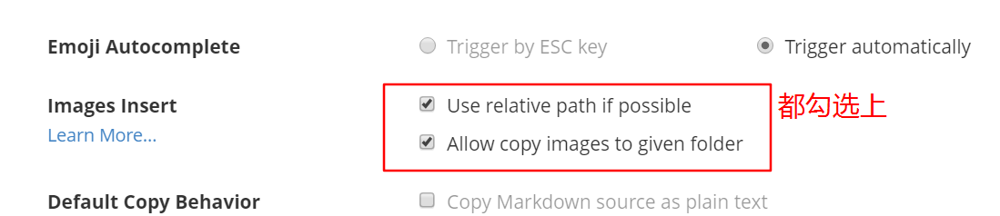
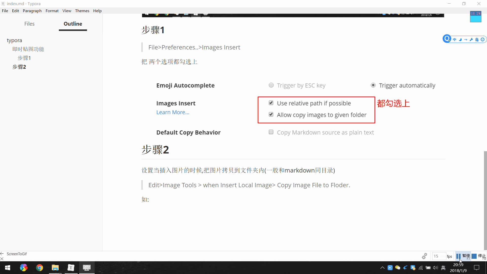
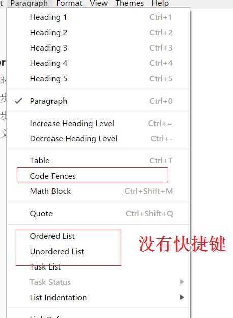
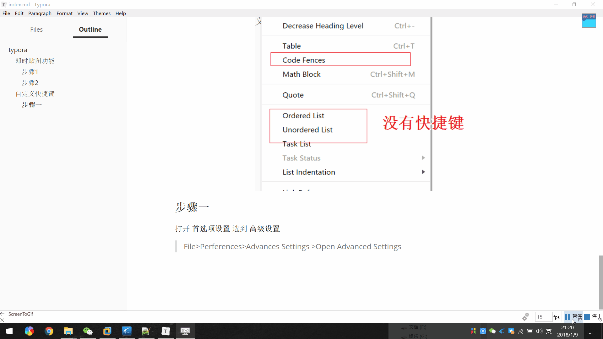
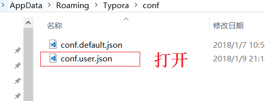
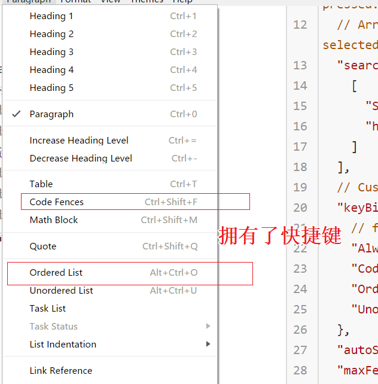

# 让 typora和word一样好用

typora是一款支持实时预览的markdown编辑器,作者在使用过其他几款的编辑器里面,发现typora的确实简单使用,而且功能强大.尤其是经过一些简单设置后,可以做到像word一样简单使用.

## 即时贴图功能

使用markdown做笔记的人应该知道,很多编辑器是不提供将粘贴图 贴到markdown中的.因为这个体验,所以很多人在处理一些带图片的文档的时候,还是宁愿使用word.现在可以分享给大家将typora设置一番后,就可以将粘贴板的图片直接贴到markdown中.如


### 步骤1 

> File>Preferences..>Images Insert  

把 两个选项都勾选上 



### 步骤2

设置当插入图片的时候,把图片拷贝到文件夹内(一般和markdown同目录)

> Edit>Image Tools > when Insert Local Image> Copy Image File to Floder.

如:



此时,拷贝你的粘贴板的图片到markdown中试试

注意,也可以直接将本地的图片拖放到markdown中.

## 自定义快捷键

由于typora有一些文字格式是没有快捷键的,所以需要实现自定义快捷键功能.如 **插入代码段 有序无序列表**  等

对于习惯使用快捷键的人来说,每次都需要手动点击的话,是很麻烦的.所以,需要自己实现快捷键的设置.



### 步骤一

打开 **首选项设置** 选到 **高级设置**

> File>Perferences>Advances Settings >Open Advanced Settings



### 步骤2

此时 打开 用户配置文件  **conf.user.json**



### 步骤3

将如下文本,全部替换即可

```json
/** For advanced users. */
{
  "width": null, // Integer - Window's width in pixels. Default is null (last window width)
  "height": null, // Integer - Window's height in pixels. Default is null (last window height)
  "defaultFontFamily": {
    "standard": null, //String - Defaults to "Times New Roman".
    "serif": null, // String - Defaults to "Times New Roman".
    "sansSerif": null, // String - Defaults to "Arial".
    "monospace": null // String - Defaults to "Courier New".
  },
  "autoHideMenuBar": false, //Boolean - Auto hide the menu bar unless the `Alt` key is pressed. Default is false.
  // Array - Search Service user can access from context menu after a range of text is selected. Each item is formatted as [caption, url]
  "searchService": [
    [
      "Search with Google",
      "https://google.com/search?q=%s"
    ]
  ],
  // Custom key binding, which will override the default ones.
  "keyBinding": {
    // for example: 
    "Always On Top": "Ctrl+Shift+P",
    "Code Fences": "Ctrl+Shift+F",
    "Ordered List": "Ctrl+Alt+o",
    "Unordered List": "Ctrl+Alt+u"
  },
  "autoSaveTimer": 5, // default 5 minutes
  "maxFetchCountOnFileList": 500
}
```

### 结果演示



### 附:

细心的同学可能发现了,作者把typora改成英文版也就是为了以后添加快捷键方便

#### 修改语言方式


## typora 快捷键

- 无序列表：输入-之后输入空格
- 有序列表：输入数字+“.”之后输入空格
- 任务列表：-[空格]空格 文字
- 标题：ctrl+数字
- 表格：ctrl+t
- 生成目录：[TOC]按回车
- 选中一整行：ctrl+l
- 选中单词：ctrl+d
- 选中相同格式的文字：ctrl+e
- 跳转到文章开头：ctrl+home
- 跳转到文章结尾：ctrl+end
- 搜索：ctrl+f
- 替换：ctrl+h
- 引用：输入>之后输入空格
- 代码块：ctrl+alt+f
- 加粗：ctrl+b
- 倾斜：ctrl+i
- 下划线：ctrl+u
- 删除线：alt+shift+5
- 插入图片：直接拖动到指定位置即可或者ctrl+shift+i
- 插入链接：ctrl+k

